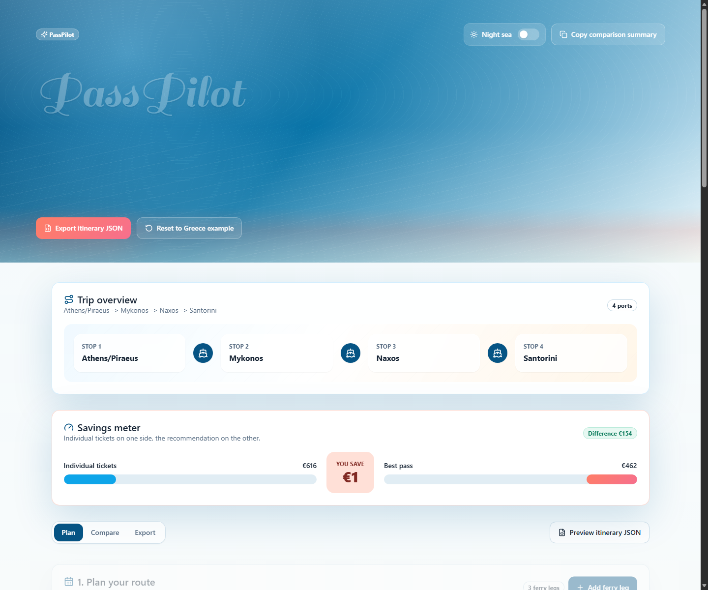

# PassPilot

PassPilot is a polished ferry and travel-pass calculator for Greek island hopping. Add an itinerary, add travelers, adjust average ferry prices, and compare individual tickets against Interrail-style and custom pass options.

This project was vibe-coded with Codex: fast product exploration, UI iteration, and shipping polish in one flow.

## Screenshots




## What It Does

- Builds an editable ferry itinerary with port autocomplete
- Adds travelers and calculates Youth, Adult, or Senior categories
- Estimates individual ferry ticket totals from average per-person prices
- Compares no-pass, Interrail Greek Islands Pass, and custom travel pass options
- Flags likely pass-covered and not-covered ferry operators
- Includes a savings meter, confidence notes, useful ferry links, JSON export, and copyable summary
- Supports light and dark mode with a navy night-sea theme

## Tech Stack

- React + Vite
- TypeScript
- Tailwind CSS
- Local shadcn-style UI primitives
- lucide-react icons
- Framer Motion
- GitHub Pages deployment workflow

## Local Development

```bash
npm install
npm run dev
```

Then open:

```text
http://127.0.0.1:5173
```

## Build

```bash
npm run build
```

## GitHub Pages

This repo includes a GitHub Actions workflow at:

```text
.github/workflows/deploy.yml
```

To publish:

1. Push the project to GitHub.
2. Open `Settings -> Pages`.
3. Under `Build and deployment`, set `Source` to `GitHub Actions`.
4. Rerun the deploy workflow from the `Actions` tab if needed.

The site will be available at:

```text
https://sonumucesh.github.io/PassPilot/
```

If the workflow fails at `actions/configure-pages@v5` with `Get Pages site failed`, Pages has not been enabled for the repo yet. Complete step 3 above, then rerun the failed workflow.

## Notes

Ferry prices change frequently, so PassPilot uses editable average prices rather than pretending to be a live fare engine. Always confirm ferry times, operators, and pass coverage before buying.
